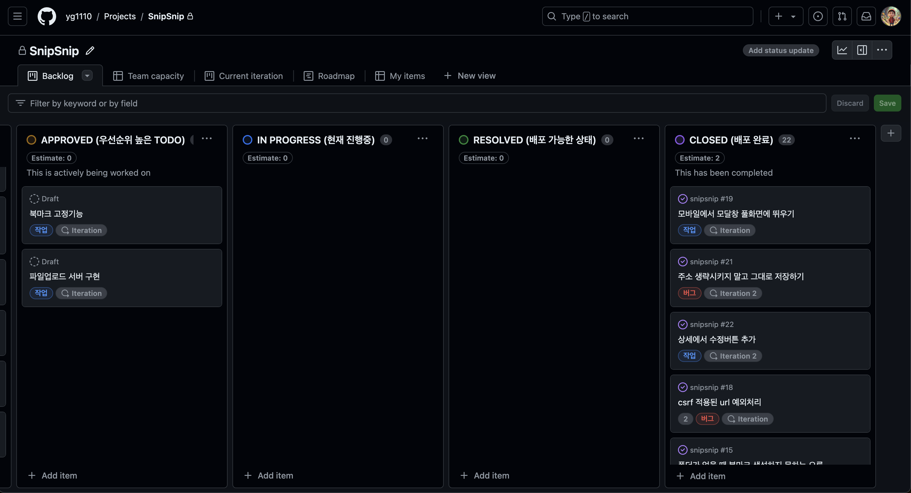
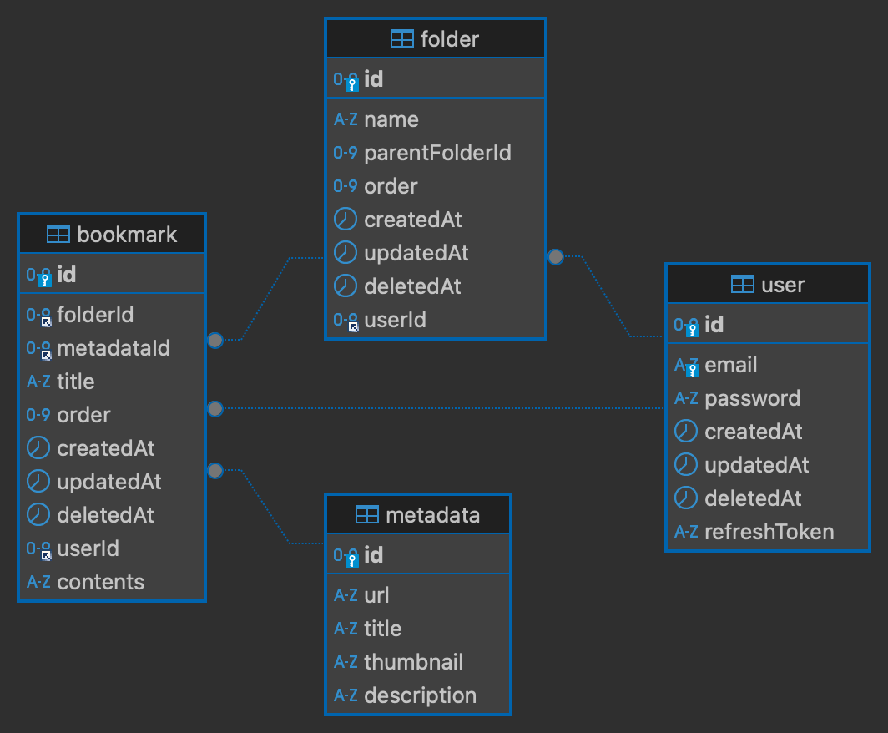
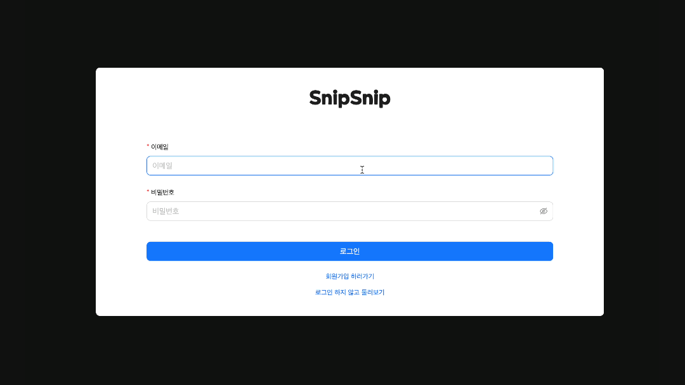
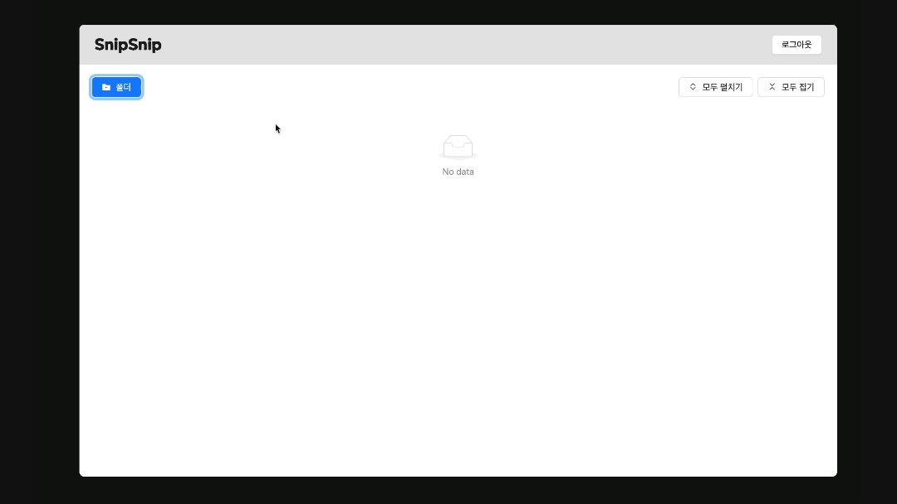
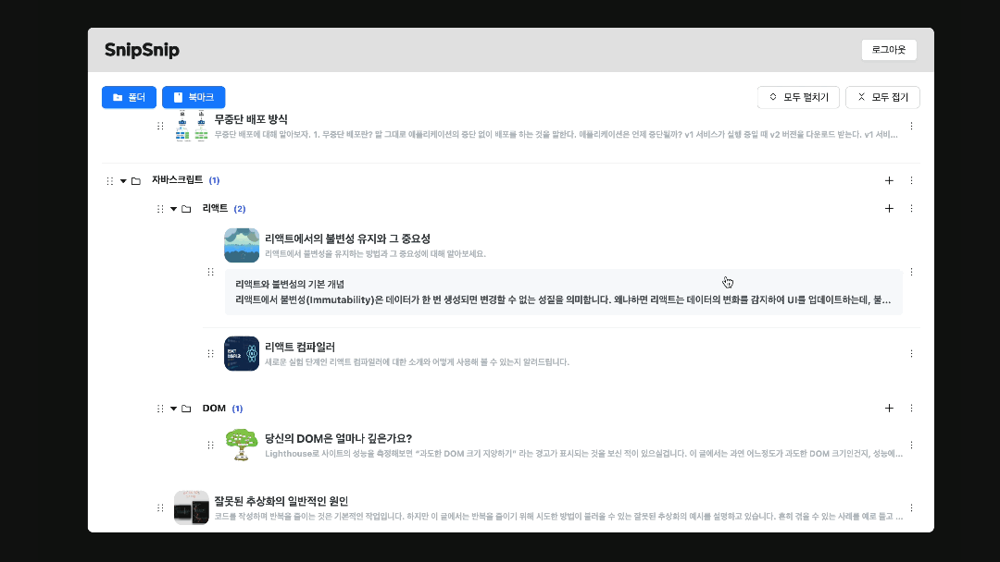
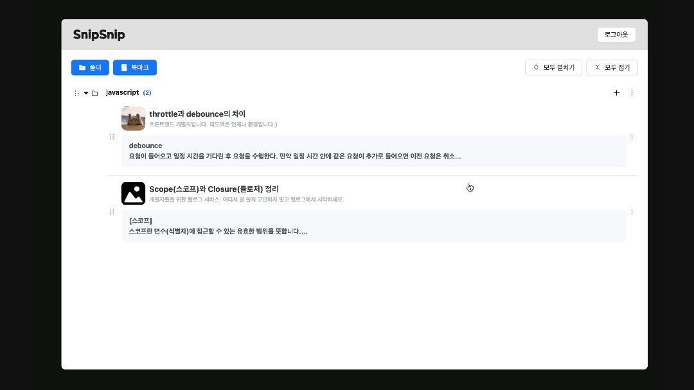
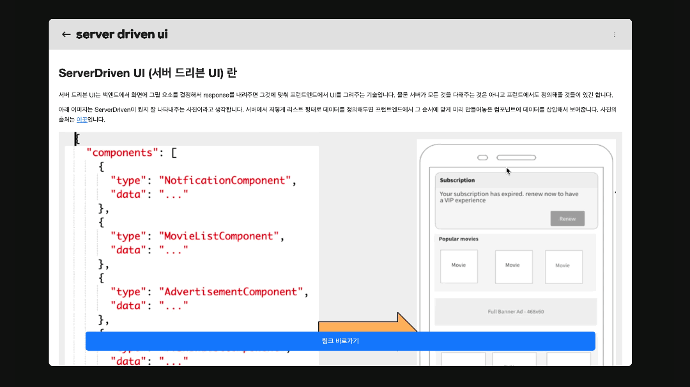
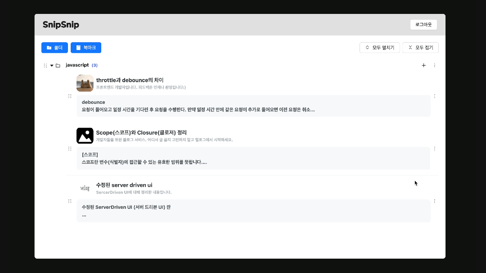

# <span> SnipSnip </span>

## 1. 소개 및 개요

- 프로젝트 소개 : 북마크의 순간을 기록하는 서비스
- 배포 URL : [🔗 SnipSnip](https://www.snipsnip.site)
- Test ID / PW : tour / tour

## 2. 기술 및 개발 환경

### [사용 기술]

- Front-end :  

- Back-end :  

- Database : 

### [개발 환경]

  

### [코드 컨벤션]

- 

```javascript
{
  printWidth: 120,
  singleQuote: true,
  tabWidth: 2
}
```

- 

```javascript
{
  "extends": "next/core-web-vitals",
  "plugins": ["react", "simple-import-sort"],
  "rules": {
    "no-unused-vars": "off",
    "react-hooks/exhaustive-deps": "warn",
    "simple-import-sort/imports": "error",
    "simple-import-sort/exports": "error"
  }
}
```

### [일정 관리]

버그와 작업을 프로젝트에 올리고 빠트리지 않고 작업하기 위해 github Proejcts를 사용했습니다.



### [배포 서비스]

  

## 4. DB 구조도



- bookmark테이블에서 모든 테이블을 참조하고 있습니다.
- bookmark 테이블에 url을 추가하지 않은 이유는 메타데이터는 추후에 다른 테이블에도 붙일 수 있을 것 이라고 판단했습니다.

## 3. 페이지 기능

- 각 페이지의 기능들을 gif로 표현했습니다.

| [로그인/회원가입]                                      | [폴더생성]                                       |
| ------------------------------------------------------ | ------------------------------------------------ |
|  |  |

| [드래그 앤 드롭]                                     | [북마크 생성]                                      |
| ---------------------------------------------------- | -------------------------------------------------- |
|  |  |

| [북마크 수정]                                      | [북마크 삭제]                                      |
| -------------------------------------------------- | -------------------------------------------------- |
|  |  |
